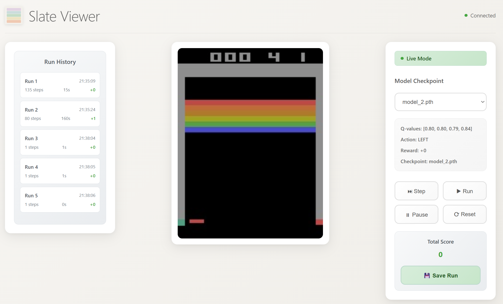

<p align="center">
  
</p>

### Python dashboard for interactive reinforcement learning agents. Slate provides a web-based interface to visualize and control reinforcement learning training runs in real-time.

## Installation

The package requires Python 3.8+ and the following dependencies:
- Flask
- Flask-SocketIO
- websockets
- gym
- opencv-python
- numpy

## Usage

To use Slate, create an agent class that inherits from `slate.Agent` and implement the required methods. Then create a `SlateClient` instance to connect your environment and agent to the dashboard.

### Basic Example

```python
import gymnasium as gym
import numpy as np
from slate import SlateClient
from slate import Agent

class RandomAgent(Agent):
    def __init__(self, env):
        self.env = env
        
    def get_action(self, frame):
        return self.env.action_space.sample()
    
    def load_checkpoint(self, checkpoint: str) -> None:
        return super().load_checkpoint(checkpoint)

    def get_q_values(self):
        return np.random.rand(self.env.action_space.n).tolist()

if __name__ == "__main__":
    env = gym.make("ALE/Breakout-v5", render_mode="rgb_array")
    agent = RandomAgent(env)
    runner = SlateClient(
        env, 
        agent, 
        endpoint="localhost", 
        run_local=True, 
        checkpoints_dir="checkpoints"
    )
    runner.start_client()
```

The `SlateClient` constructor accepts:
- `env`: A Gym-like environment that supports reset, step, and render methods
- `agent`: An agent instance that inherits from `slate.Agent`
- `endpoint`: The server endpoint (default: "localhost")
- `run_local`: Whether to run the Slate server locally (default: False)
- `checkpoints_dir`: Directory containing model checkpoint files (optional)

When `run_local=True`, the dashboard will be available at `http://localhost:8000` after calling `start_client()`.

## Example of UI


